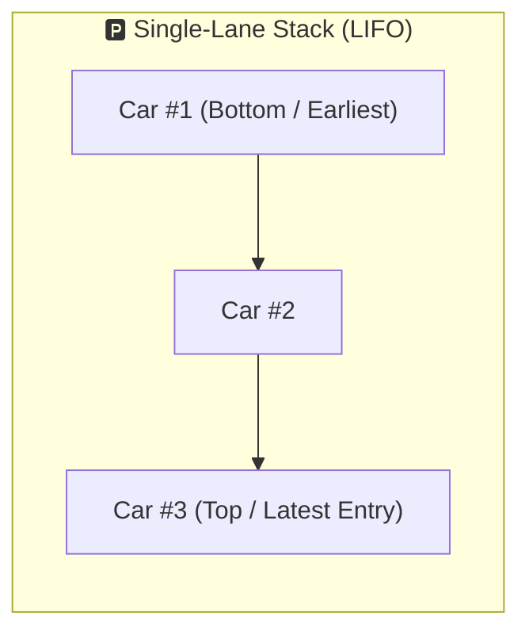
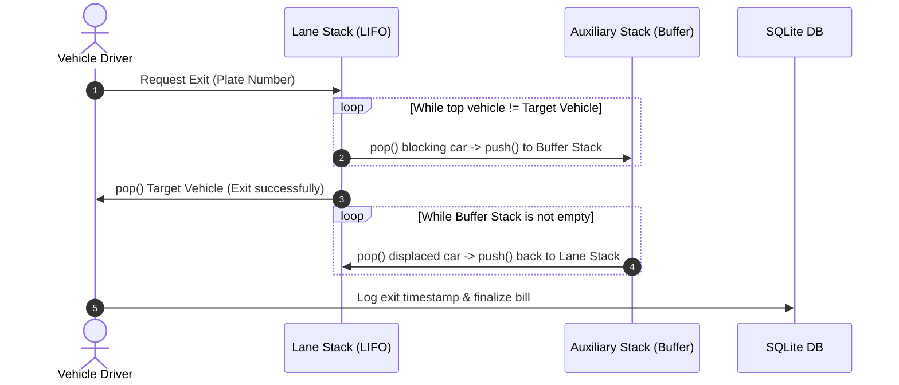
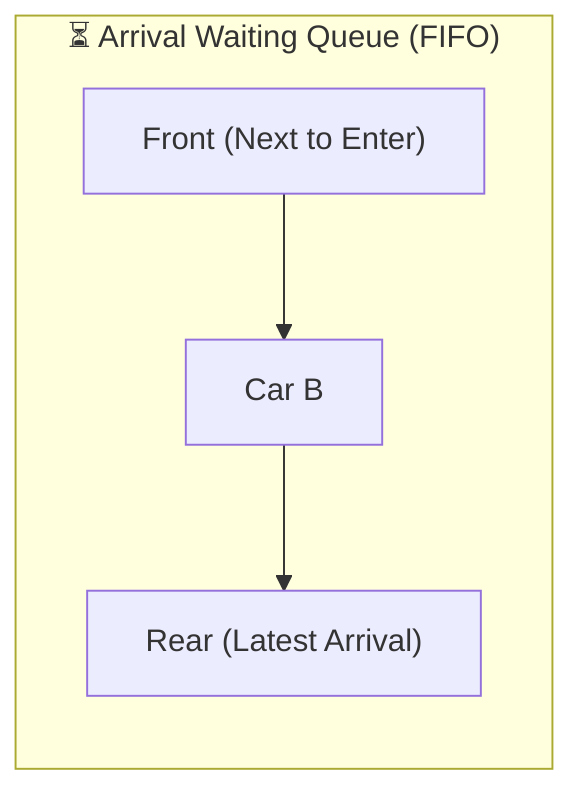
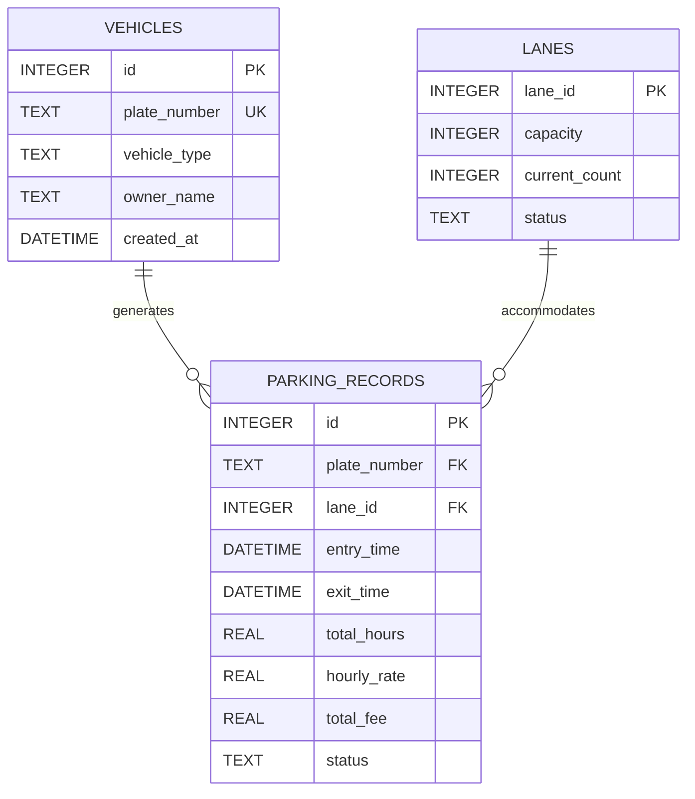

# 🚗 Smart Parking Lot Management System

[](https://www.oracle.com/java/)
[](https://www.sqlite.org/)
[](#-data-structures--algorithmic-logic)
[](https://opensource.org/licenses/MIT)
[](https://github.com/Ermiya-Rostamzade/PARKING)

An algorithmic, high-performance **Parking Lot Management System** engineered in **Java** and backed by **SQLite** for robust persistent data storage. The application simulates the complex real-world dynamics of multi-lane automated garages and single-entry/single-exit driveways using custom **Linked-List-based Stacks and Queues**. It addresses physical constraints such as LIFO vehicle obstruction, auxiliary buffer reshuffling, admission waiting lines, and automated fee processing.

---

## 📑 Table of Contents

- [Overview](#-overview)
- [Key Features](#-key-features)
- [System Architecture](#-system-architecture)
- [Data Structures & Algorithmic Logic](#-data-structures--algorithmic-logic)
  - [1. Parking Lanes (Stack - LIFO)](#1-parking-lanes-stack---lifo)
  - [2. Vehicle Retrieval & Reshuffling Algorithm](#2-vehicle-retrieval--reshuffling-algorithm)
  - [3. Waiting Line (Queue - FIFO)](#3-waiting-line-queue---fifo)
  - [Complexity Analysis](#complexity-analysis)
- [Database Design & ER Diagram](#-database-design--er-diagram)
- [Project Directory Structure](#-project-directory-structure)
- [Installation & Getting Started](#-installation--getting-started)
- [CLI Workflow & Demo](#-cli-workflow--demo)
- [Roadmap & Enhancements](#-roadmap--enhancements)
- [Author & License](#-author--license)

---

## 🌟 Overview

In compact urban garages and automated parking racks, vehicles are typically parked bumper-to-bumper in narrow, single-entry/single-exit lanes. In such an arrangement, a car parked deeper inside the lane cannot leave freely if other vehicles are blocking its path to the exit.

This project solves this operational problem algorithmically:
1. **Physical Obstruction Modeling**: Uses **LIFO (Last-In, First-Out)** stacks to represent parking lanes.
2. **Auxiliary Buffer Reshuffling**: When a vehicle deep in the stack requests to depart, blocking vehicles are systematically shifted to an auxiliary buffer stack, the target car is dispatched, and the displaced cars are restored to their original relative positions.
3. **Capacity Management & Waiting Lines**: Uses a **FIFO (First-In, First-Out)** queue to manage arriving vehicles when all parking lanes reach maximum capacity.
4. **Reliable Persistence**: Uses an embedded **SQLite** database via JDBC to log check-in/check-out timestamps, compute hourly tariffs, track historical records, and restore system state across reboots.

---

## ✨ Key Features

- **Automated Space Allocation**: Automatically checks lane occupancies and directs incoming vehicles to available lanes or appends them to the waiting queue.
- **Smart Vehicle Evacuation (Reshuffling)**: Handles non-top vehicle exit requests via auxiliary stack operations while preserving vehicle order and tracking displacement steps.
- **Dynamic Tariff & Billing Engine**: Accurately records arrival and departure timestamps down to the second, calculating payable amounts based on configurable hourly rates.
- **Robust SQLite Persistence**: Transaction-safe schema creation, entry/exit logging, plate indexing, and parking history tracking.
- **Interactive Terminal Interface**: Clean, menu-driven CLI for operators to inspect parking status, search vehicles, issue tickets, and generate revenue summaries.
- **Zero Heavy External Dependencies**: Core algorithmic containers (Stack and Queue) are written from scratch using linked nodes for maximum educational transparency and runtime control.

---

## 🏛 System Architecture

The following diagram illustrates the lifecycle of a vehicle entering, waiting, parking, reshuffling, and leaving the facility:

```mermaid
flowchart TD
    Start([Vehicle Arrives at Gate]) --> CheckCap{Is any lane available?}
    
    CheckCap -- No --> EnqueueWaiting[Enqueue into Waiting Line
(Custom FIFO Queue)]
    CheckCap -- Yes --> ParkLane[Push into Available Lane
(Custom LIFO Stack)]
    
    EnqueueWaiting -. When lane frees up .-> ParkLane
    
    ParkLane --> ParkedState[(Vehicle Actively Parked)]
    
    ParkedState --> ExitRequest[Departure Requested by Plate]
    ExitRequest --> CheckPosition{Is vehicle at Lane Top?}
    
    CheckPosition -- Yes --> DirectExit[Pop from Lane Stack]
    CheckPosition -- No --> ReshuffleLoop[Pop blocking cars onto
Auxiliary Buffer Stack]
    
    ReshuffleLoop --> TargetPopped[Pop Target Vehicle]
    TargetPopped --> RestoreCars[Pop cars from Buffer Stack
and Push back into Lane Stack]
    
    DirectExit --> CalcBill[Calculate Duration & Fee]
    RestoreCars --> CalcBill
    
    CalcBill --> DBCommit[(Persist to SQLite Database
Update Status & Timestamps)]
    DBCommit --> DepartureComplete([Vehicle Leaves Garage])
```

---

## 🧠 Data Structures & Algorithmic Logic

### 1. Parking Lanes (Stack - LIFO)
Each lane has a fixed capacity $N$. Vehicles parked earlier are placed at the bottom, while recently parked cars sit near the entrance/exit threshold:



### 2. Vehicle Retrieval & Reshuffling Algorithm

When vehicle `Car #K` needs to exit and is situated below top vehicles, the departure algorithm proceeds in three phases:



### 3. Waiting Line (Queue - FIFO)

Vehicles arriving when all lanes are full wait in a fair FIFO order:



### Complexity Analysis

| Operation | Data Structure | Best Case | Average / Worst Case | Notes |
| :--- | :--- | :---: | :---: | :--- |
| **Vehicle Enqueue** | FIFO Queue | $\mathcal{O}(1)$ | $\mathcal{O}(1)$ | Added at the tail pointer |
| **Vehicle Dequeue** | FIFO Queue | $\mathcal{O}(1)$ | $\mathcal{O}(1)$ | Removed from head pointer |
| **Park at Top** | LIFO Stack | $\mathcal{O}(1)$ | $\mathcal{O}(1)$ | Pushed to available lane |
| **Exit from Top** | LIFO Stack | $\mathcal{O}(1)$ | $\mathcal{O}(1)$ | Direct `pop()` without displacements |
| **Deep Exit (Reshuffling)**| LIFO Stack | $\mathcal{O}(1)$ | $\mathcal{O}(k)$ | $k$ is the number of blocking vehicles |
| **Database Query** | SQLite Index | $\mathcal{O}(1)$ | $\mathcal{O}(\log M)$ | Indexed B-Tree search on license plate |

---

## 🗄 Database Design & ER Diagram

The system employs SQLite to maintain data integrity across application sessions.



### SQL Schema Definition

```sql
-- Registered vehicles table
CREATE TABLE IF NOT EXISTS vehicles (
    id INTEGER PRIMARY KEY AUTOINCREMENT,
    plate_number TEXT UNIQUE NOT NULL,
    vehicle_type TEXT DEFAULT 'CAR',
    owner_name TEXT,
    created_at DATETIME DEFAULT CURRENT_TIMESTAMP
);

-- Active and historical parking transaction logs
CREATE TABLE IF NOT EXISTS parking_records (
    id INTEGER PRIMARY KEY AUTOINCREMENT,
    plate_number TEXT NOT NULL,
    lane_id INTEGER NOT NULL,
    entry_time DATETIME NOT NULL,
    exit_time DATETIME,
    total_hours REAL,
    hourly_rate REAL DEFAULT 15.0,
    total_fee REAL DEFAULT 0.0,
    status TEXT CHECK(status IN ('PARKED', 'COMPLETED', 'CANCELLED')),
    FOREIGN KEY(plate_number) REFERENCES vehicles(plate_number)
);

CREATE INDEX IF NOT EXISTS idx_plate_status ON parking_records(plate_number, status);
```

---

## 📂 Project Directory Structure

```text
PARKING/
├── src/
│   ├── datastructures/           # Custom Linked-List data structure implementations
│   │   ├── Node.java             # Generic node for stacks and queues
│   │   ├── CustomStack.java      # Linked-list LIFO stack implementation
│   │   └── CustomQueue.java      # Linked-list FIFO queue implementation
│   ├── model/                    # Domain models & entities
│   │   ├── Car.java              # Vehicle attributes (plate, type, entry time)
│   │   ├── Lane.java             # Parking lane wrapping a CustomStack
│   │   └── ParkingTicket.java    # Billing ticket and transaction entity
│   ├── database/                 # Persistence layer
│   │   ├── DatabaseConnection.java # SQLite JDBC connection manager
│   │   └── ParkingDao.java       # CRUD operations for parking logs
│   ├── service/                  # Core business logic
│   │   ├── ParkingLotManager.java# Lane allocation, reshuffle, and queue management
│   │   └── BillingService.java   # Rate computation and duration calculations
│   └── Main.java                 # Interactive Console Application entry point
├── lib/
│   └── sqlite-jdbc.jar           # SQLite JDBC connector
├── .gitignore
├── LICENSE
└── README.md
```

---

## 🚀 Installation & Getting Started

### Prerequisites
- **Java Development Kit (JDK)**: Version 11 or higher installed ([Download JDK](https://www.oracle.com/java/technologies/downloads/))
- **Git**: For cloning the repository
- **SQLite JDBC Driver**: (Placed in `lib/` or managed via build tool)

### Quick Start Guide

1. **Clone the Repository:**
   ```bash
   git clone https://github.com/Ermiya-Rostamzade/PARKING.git
   cd PARKING
   ```

2. **Compile the Source Code:**
   - **Linux / macOS:**
     ```bash
     mkdir -p bin
     javac -cp "lib/*:src" -d bin src/**/*.java
     ```
   - **Windows (PowerShell):**
     ```powershell
     New-Item -ItemType Directory -Force -Path bin
     javac -cp "lib/*;src" -d bin (Get-ChildItem -Recurse -Filter *.java src).FullName
     ```

3. **Run the Application:**
   - **Linux / macOS:**
     ```bash
     java -cp "lib/*:bin" Main
     ```
   - **Windows (PowerShell):**
     ```powershell
     java -cp "lib/*;bin" Main
     ```

---

## 💻 CLI Workflow & Demo

When launched, the console interface provides real-time control over the garage operations:

```text
============================================================
              🚗 SMART PARKING MANAGEMENT SYSTEM
============================================================
[1] 📥 Park Arriving Vehicle (Check-In)
[2] 📤 Dispatch Departing Vehicle (Check-Out & Invoice)
[3] 🔍 Search Vehicle by License Plate
[4] 📊 Display Real-Time Garage Overview (Lanes & Queue)
[5] 💰 Financial Revenue & Transaction Logs
[6] ❌ Exit Application
------------------------------------------------------------
Select an option (1-6): 1

Enter License Plate Number: 54A890-IR
Enter Vehicle Type (CAR / SUV / MOTORCYCLE): CAR
Checking available parking lanes...
[SUCCESS] Vehicle 54A890-IR parked in Lane #2 at position #3.
Entry Timestamp: 2026-09-02 20:15:00
```

### Evacuation (Reshuffling) Output Sample:
```text
Select an option (1-6): 2
Enter License Plate Number to exit: 54A890-IR

Searching Lane #2...
Vehicle found at depth 2 (1 vehicle blocking exit).
------------------------------------------------------------
[RESHUFFLE] Displacing vehicle (77C123-IR) to Auxiliary Buffer...
[EXIT] Target vehicle (54A890-IR) safely evacuated!
[RESTORE] Returning vehicle (77C123-IR) to Lane #2.
------------------------------------------------------------
Duration Parked : 2.50 hours
Hourly Tariff   : $15.00 / hr
Total Amount Due: $37.50
[DATABASE] Transaction recorded successfully. Status: COMPLETED.
```

---

## 🔮 Roadmap & Enhancements

- [x] Custom linked-list implementation for Stack and Queue.
- [x] LIFO reshuffling algorithm with temporary buffer.
- [x] SQLite JDBC persistent storage.
- [ ] **Desktop GUI**: Native graphical dashboard built with JavaFX.
- [ ] **ANPR Integration**: Automated license plate detection simulation.
- [ ] **Multi-Rate Tiers**: Differentiated pricing based on vehicle dimensions (SUV, Sedan, EV charging spots).
- [ ] **REST API Bridge**: Spring Boot wrapper to expose garage endpoints to mobile client apps.

---

## 👤 Author & License

Developed with ❤️ by **Ermiya Rostamzade**.

- **GitHub**: [@Ermiya-Rostamzade](https://github.com/Ermiya-Rostamzade)
- **Course**: Data Structures & Advanced Java Programming

This project is licensed under the **MIT License** - see the [LICENSE](LICENSE) file for details.
